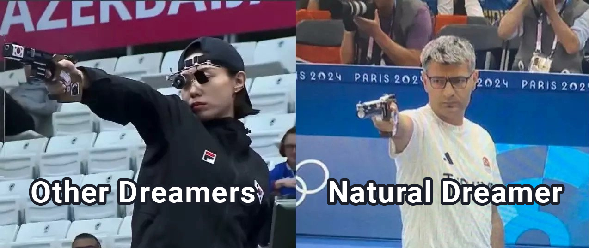
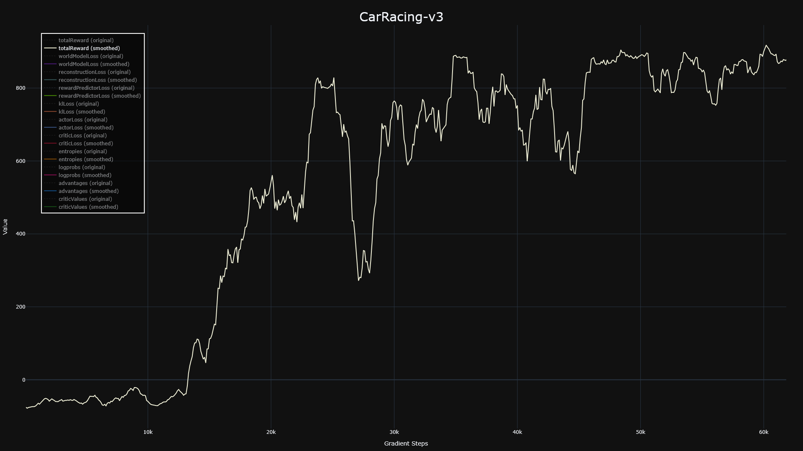

# Natural Dreamer is a natural.

Natural Dreamer is a simple and clean implementation of DreamerV3 paper, that makes it maximally easy to study the architecture and understand the training pipeline.

🚧 Warning 🚧: The repo isn't in it's final form, it's still work in progress. Core algorithm works, but I should benchmark it on many types of environments, while right now, only CarRacing-v3 env (continuous actions, image observations) is solved.

## Performance

Only CarRacing-v3 is solved for now.

Plot is nicely cropped, since after that point the performance started slowly declining. Environment steps are roughly 1000x the gradient steps, so around 600k environments steps. I mostly show gradient steps because I could greatly increase the replay ratio to minimize the environment steps.

## How to use it?

DreamerV3 tutorial with diagrams, code walkthrough and usage examples has been (or will be) shown on my [YouTube Channel](https://www.youtube.com/@inexperiencedme).

To run the code yourself:
1. Clone the repo
2. Install requirements.txt
3. Run main.py

For the list of available arguments check main.py.

## TODO

- TwoHot loss isn't implemented yet with rewardModel and critic. I made an attempt and wrote neat code for it, but it didn't work and I'm out of ideas on how to proceed, so that's yet to be finished. For now, rewardModel and critic use normal distribution.
- Discrete actions. That will be easy, just a few lines of code when I'll start solving more environments.
- Add vector observations encoder and decoder.
- Reconstruction loss is huge (11k), messing up graphs' scale. But graphs are only for debugging, so it's not a priority.
- Soft Critic cannot be neatly implemented with the current setup, without unnecessarily many net passes. I'm ignoring it for now, but maybe it will be needed one day.
- Continue prediction is untested, so there is no guarantee that it works.

## Acknowledgements

This implementation would never came to be if not for:

[SimpleDreamer](https://github.com/kc-ml2/SimpleDreamer) - which is the cleanest implementation of DreamerV1 I could find, which helped tremendously.

[SheepRL DreamerV3](https://github.com/Eclectic-Sheep/sheeprl) - which was the performant and complex DreamerV3 version, that I studied a lot for all these little performance tricks. It's complex and hard and fairly messy, but still miles ahead of original DreamerV3 code, so I could study it successfully.

[Cameron Redovian](https://github.com/naivoder) as a person, who was working on his own DreamerV3 at the same time as I was, and his attempts somehow helped me understand the training process, especially prior and posterior nets cooperation.
